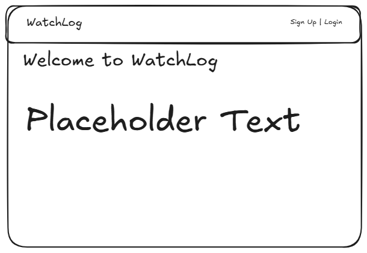
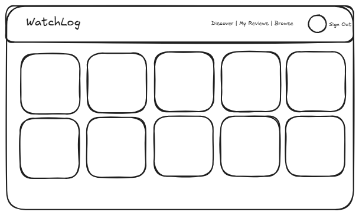
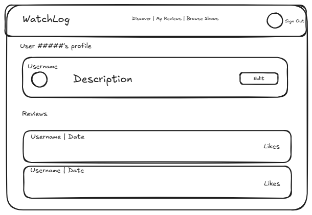
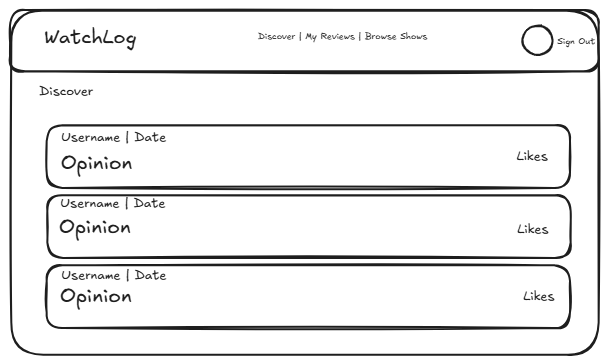
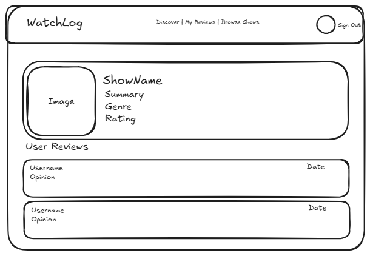
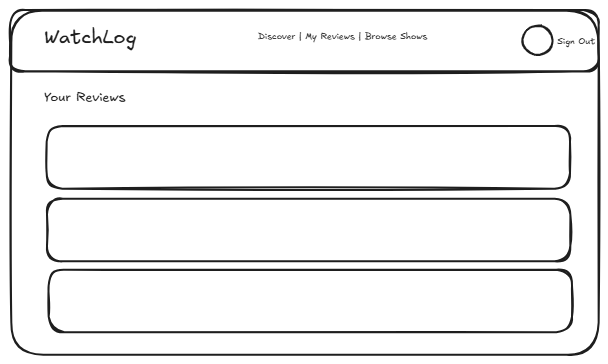
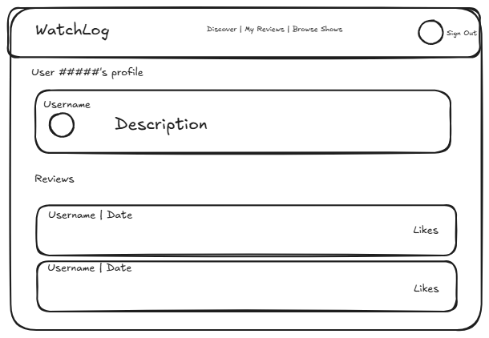
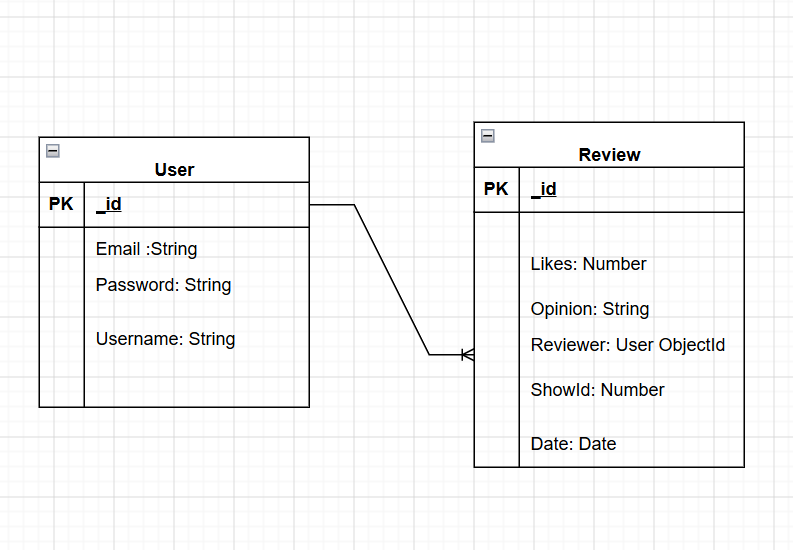

# WatchLog
### Track and Review Your Favourite Shows!

Sign Up, View Shows you watched, leave a review, like other's reviews!

## User Stories
* As a User, I want to be able to select a show from a collection of shows to log.
* As a user, I want to sign up for an account and have my saved shows when i log in everytime.
* As a user, I need a page to view all my reviews.
* As a user, I want to be able to add a review for each show i reviewed.
* As a user, I want to be able to edit and delete my reviews.
* As a user, i want to be able to view random user's reviews on a discover page.
* As a user, i want to be able to view other user's profile with all their reviews.

## Wireframes

### Landing Page

### Home Page

### Your Profile

### Discover

### Show Profile

### Your Reviews

### Others Profile

## Entity Relationship Diagram

## Routes Table
| Method | Path | Purpose|
|--------|------|--------|
| **Auth Routes** |                
| GET | `/auth/sign-up` | Register Page |
| GET | `/auth/sign-in` | Login Page |
| POST | `/auth/sign-up` | Create Account |
| POST | `/auth/sign-in` | Login |
| **Common Routes** |                
| GET | `/` | Get Landing Page |
| GET | `/home` | Get Home Page |
| GET | `/profile` | Get User's Own Profile |
| **User Routes** |                
| GET | `/users` | Get all Users |
| GET | `/users/:id` | Get specific User |
| PUT | `/users/:id` | Update User |
| **Review Routes** |                
| GET | `/reviews` | Get all Reviews |
| GET | `/reviews/:id` | Get specific Review |
| POST | `/reviews` | Create Review |
| PUT | `/reviews/:id` | Update Review |
| PATCH | `/reviews/:id` | Like/Dislike Review |
| DELETE | `/reviews/:id` | Delete Review |

